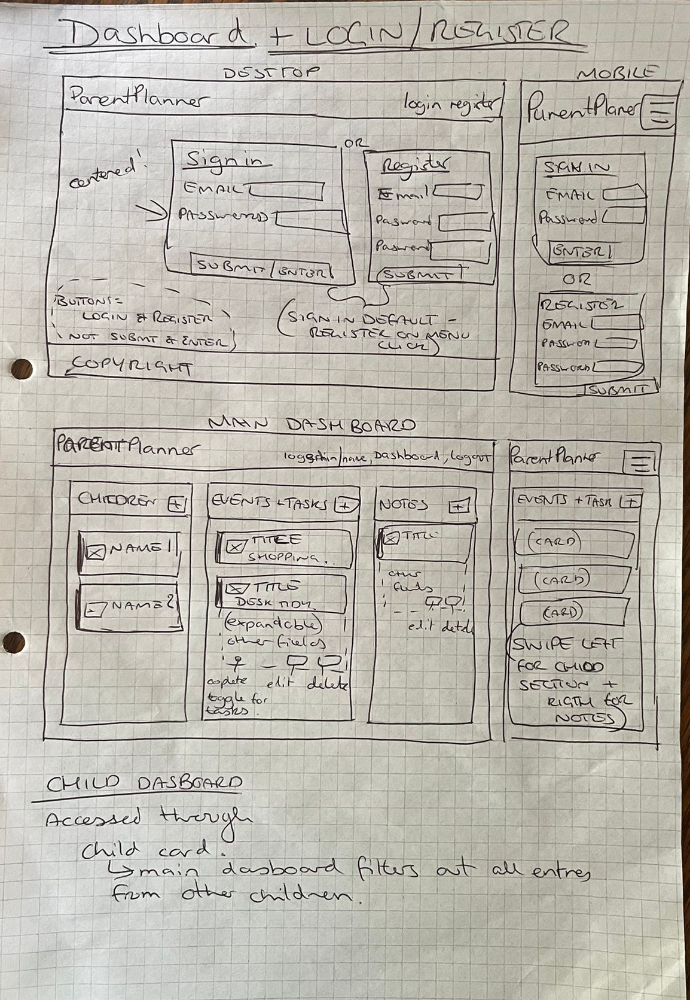

# �‍👩‍👧‍👦 ParentPlanner

ParentPlanner is a web application designed to help modern families stay organised and manage their daily activities effectively. The app enables parents to create personalised profiles for each child, track important tasks and events, and maintain clear oversight of family schedules. 

**Live Application:** [parentplanner-0a7a2e9a2998.herokuapp.com](https://parentplanner-0a7a2e9a2998.herokuapp.com)

## 📋 Table of Contents
- [User Stories](#user-stories)
- [Design & Wireframes](#design--wireframes) 
- [Features](#features)
- [Deployment](#deployment)
- [Testing](#testing)
- [Credits](#credits)

## 📋 User Stories

The ParentPlanner App was developed with specific user needs in mind, addressing real-world challenges faced by modern families in managing their daily activities and long-term planning.

### 📝 Must Haves
- **Registration & Setup**: "As a user, I want to quickly create an account and set up my family profile so that I can start organising our activities immediately without complex setup procedures."
- **Child Profile Management**: "As a user, I want to create individual profiles for each child with their school information and personal details so that I can track activities and school-specific events."
- **Quick Entry Creation**: "As a user, I want to quickly add notes, tasks, and events for my children from a single form so that I don't have to navigate through multiple screens to capture important information."
- **Family Overview Dashboard**: "As a user, I want to see all my children's activities in one centralised dashboard so that I can quickly assess our family's schedule and identify potential conflicts or busy periods."
- **Category Organization**: "As a user, I want to categorize entries (School, Sports, Health, Entertainment) so that I can quickly filter and focus on specific areas of my children's lives."
- **Due Date Tracking**: "As a user, I want to see which tasks are approaching their due dates with clear visual indicators so that I can prioritise and ensure nothing is forgotten."
- **Child-Specific Views**: "As a user, I want to filter and view activities for individual children so that I can focus on one child's events through expandable child cards with comprehensive information display."
- **Entry Management**: "As a user, I want to easily edit and modify existing entries so that I can keep our family information current as situations change."
- **Attractive and legible design**: "As a user, I want the app to have a simple yet colourful design, with clear fonts so that I can easily read the information and it looks attractive."
- **Mobile first design**: "As a user, I want the app to be mobile first so that I can access the app on the go."
- **Navigation**: "As a user, I want to be able to easily navigate the app so that I can quickly and efficiently view and input information."

### 📝 Should Haves
- **Event time management**: "As a user, I want to see start and end times clearly so that I can avoid double-booking."
- **Family Sharing**: "As a user, I want to share selected event information so that both parents stay informed."
- **Export capabilities**: "As a user, I want to export relevant schedule information so that I can share appropriate details with teachers, babysitters, and family members who need to know our availability/child schedule."
- **Colour coded activity types**: "As a user, I want to see notes, tasks, and events displayed in different colours so that I can quickly identify the type of activity without reading details."

### 📝 Could Haves
- **Location Awareness**: "As a user: I want to see event locations so that I can plan efficient routes and account for travel time."
- **Monthly calendar view**: "As a user I want to see all family activities displayed on a monthly calendar so that I can quickly identify busy periods and plan accordingly."
- **Individual child calendars**: "As a user I want to view individual calendar pages for each child so that I can focus on one child's commitments when discussing their schedule."
- **Easy calendar date entries**: "As a user I want to click on any calendar date and immediately create an entry for that specific day so that I can plan ahead efficiently while viewing our schedule."
- **Quick calendar navigation**: "As a user I want to easily navigate between different months and years so that I can schedule future events and review past activities."
## 🎨 Design & Wireframes

### Color Scheme
ParentPlanner uses a modern, family-friendly color palette designed for clarity and visual appeal:

**Primary Colors:**
- Primary: `#4F46E5` (Indigo Blue) - Main brand color for navigation and primary actions
- Secondary: `#7C3AED` (Purple) - Secondary brand color for accents and highlights
- Accent: `#F59E0B` (Amber/Yellow) - Call-to-action buttons and important highlights
- Accent Blue: `#06B6D4` (Cyan) - Additional accent for variety and visual interest

**Supporting Colors:**
- Surface: `#FFFFFF` (White) - Main background color
- Neutral: `#F8FAFC` (Light Gray) - Secondary background and cards
- Border: `#E2E8F0` (Light Gray) - Borders and dividers
- Text Gray: `#64748B` (Slate Gray) - Secondary text and subtitles

### Wireframes & Design Evolution
The application was designed with a mobile-first approach, featuring:
- **Four-section dashboard**: Children, Events, Tasks, Notes
- **Expandable child cards**: Consolidated view instead of separate pages
- **Responsive design**: Swipe navigation on mobile/tablet, grid layout on desktop
- **Modal forms**: Streamlined entry creation and editing

### Design Decisions
- **Consolidated Dashboard**: Single-view approach for better family overview
- **Category Standardization**: Unified categories across all entry types
- **Mobile-First**: Touch-friendly interface optimized for busy parents on-the-go

## 📋 Features

### 📝 Existing Features

#### 👤 Authentication
The application features a comprehensive email-based user registration and login system that provides secure password authentication using Django's built-in security features. Users benefit from automatic session management with login persistence, ensuring a seamless experience across browsing sessions. The secure logout functionality properly terminates user sessions, while user account isolation guarantees that family data remains private and separated between different user accounts.

#### 🧭 Navigation
The navigation system includes a responsive navigation bar that seamlessly adapts between mobile and desktop screen sizes. Users are welcomed with a personalised message displaying their logged-in username, alongside quick access links to the Dashboard and Logout functionality. Mobile users enjoy an optimised hamburger menu designed specifically for smaller screens, all supported by a clean and intuitive navigation structure that makes moving through the application effortless.

#### � Dashboard
The dashboard presents a centralised four-section layout that elegantly displays Children, Events, Tasks, and Notes in an organised manner. Real-time content updates occur without requiring page refreshes, while the responsive grid system intelligently adapts from a mobile stack layout to a desktop four-column arrangement. Each section features distinct colour coding for easy visual identification, with individual section scrolling capabilities when content exceeds the viewport height. Interactive task completion provides instant visual feedback, while chronological event sorting ensures upcoming activities appear first. The dashboard is completed with a professional footer containing copyright and branding information.

Dashboard Mobile View Mobile-optimised dashboard with stacked layout

👤 Child Management
Parents can create comprehensive individual child profiles that include personalised information and unique colour assignments for easy visual identification throughout the application. The system allows for detailed school information recording, including school names and year groups, with the flexibility to edit and update child profiles as information changes over time.

Child Profile Cards Expandable child cards with colour-coded identification

The application implements expandable child cards within the main dashboard that provide focused management capabilities. Each child card displays essential information including coloured initials, names, birth dates, and a summary of their activities. When expanded, cards reveal detailed school information, year levels, and class details. Child cards include edit and delete functionality with inline modal dialogs, allowing parents to modify child information without leaving the dashboard view. This consolidated approach ensures efficient family management while maintaining quick access to individual child details.

Child Card Expanded Expanded child card showing detailed information and management options

Add Child Modal Add new child modal with comprehensive profile fields

👤 Entry System
The application supports three distinct entry types: Events, Tasks, and Notes, each designed for specific family management needs. A smart categorisation system organises activities into School, Sports, Health, and Entertainment categories for efficient organisation. Event management includes separate start and end time tracking, while task management incorporates due dates and priority levels ranging from High to Medium to Low importance. Note-taking functionality provides a space for general family information and reminders, with rich text support enabling detailed descriptions across all entry types.

Add Entry Modal Unified entry creation modal with category selection

Task Management Task list with completion status and priority indicators

#### � Calendar View
The calendar view functionality is currently under active development for future release, with plans for a comprehensive monthly calendar view that will display activities visually. Individual child calendar pages are planned to provide focused scheduling capabilities, allowing parents to manage each child's commitments separately while maintaining an overview of the entire family schedule.

#### � Entry Management
Complete CRUD operations (Create, Read, Update, Delete) are available for all entry types, ensuring full data management capabilities. Users can edit existing entries using pre-populated forms that maintain data integrity, while unwanted entries can be deleted with appropriate confirmation prompts. Task completion features include a toggle system with immediate visual feedback, automatic reordering of completed tasks for better organization, and child-specific entry filtering that enables focused management of individual children's activities.

#### � Responsive Design
The application employs a mobile-first design approach that has been specifically optimised for smartphone usage while scaling beautifully to larger devices. Tablet users enjoy a touch-optimised interface that takes advantage of the larger screen real estate, while desktop users benefit from an enhanced four-column grid layout that maximises productivity. The flexible layout system adapts seamlessly to any screen size, ensuring a consistent user experience across all devices with touch-friendly buttons and interactive elements that work equally well with finger taps or mouse clicks.

### 📝 Future Features

#### 👤 Enhanced Child Profiles
Future development will expand child profiles to include comprehensive personal information such as photos and detailed personal characteristics. The system will incorporate medical information tracking capabilities for allergies, medications, and emergency contact details to ensure child safety and proper care coordination. Academic progress monitoring features will track grades and teacher information, while activity history and achievement tracking will provide parents with a complete picture of their child's development. Additional features will include growth charts and milestone recording capabilities, with planned integration to school systems for automatic updates that keep information current without manual data entry.

#### � Notification & Reminder System
A comprehensive notification system will provide email reminders for upcoming events and task due dates, ensuring families never miss important commitments. Browser push notifications will alert users to time-sensitive activities, with customizable reminder timing options including 15-minute, 1-hour, and 1-day advance warnings. SMS notifications will be available for critical events and emergencies, while family member notification sharing will keep all relevant parties informed. The system will feature smart reminder frequency algorithms that adjust notification timing based on event importance and user preferences.

👤 Email Integration & Parsing Module
Advanced email integration will automatically import events from school email notifications, eliminating manual data entry for routine school communications. Calendar invitation parsing will seamlessly integrate external events into the family schedule, while an email forwarding system will facilitate family coordination. Teacher communication tracking and organization features will maintain a record of important school correspondence, with automated parsing of school newsletters and important dates. The system will integrate with popular email providers including Gmail and Outlook to ensure broad compatibility across different email platforms.

## � Deployment

**Live Application:** [parentplanner-0a7a2e9a2998.herokuapp.com](https://parentplanner-0a7a2e9a2998.herokuapp.com)

The ParentPlanner application is deployed and accessible using the Heroku Cloud Platform for reliable hosting and scalability. The production environment utilises PostgreSQL through Heroku Postgres for robust data management, while WhiteNoise middleware provides efficient static file serving that ensures fast loading times for CSS, JavaScript, and image assets.

### 📝 Heroku Deployment Process
The deployment process begins with ensuring all prerequisites are met, including having a Heroku account with the Heroku CLI installed, a Git repository with all code properly committed, a complete requirements.txt file listing all dependencies, and a Procfile configured for Heroku process management.

The deployment workflow starts with creating the Heroku application using heroku create parentplanner-app, followed by adding a PostgreSQL database through heroku addons:create heroku-postgresql:hobby-dev for data persistence. Environment variables are configured securely using heroku config:set SECRET_KEY=your-secret-key-here and heroku config:set DEBUG=False to ensure production security settings.

Application deployment occurs through git push heroku main, which automatically builds and deploys the application to Heroku's infrastructure. Database setup is completed by running migrations with heroku run python manage.py migrate and creating an administrative user through heroku run python manage.py createsuperuser. Finally, static files are collected and optimised using heroku run python manage.py collectstatic --noinput to ensure all CSS, JavaScript, and image files are properly served.

### 📝 Local Development Setup
Local development begins by cloning the repository using git clone https://github.com/EKennard/Parent-Planner.git followed by navigating to the project directory with cd Parent-Planner. A virtual environment is created and activated using python -m venv venv and source venv/bin/activate on Unix systems or venv\Scripts\activate on Windows systems to isolate project dependencies.

Dependencies are installed through pip install -r requirements.txt, which ensures all necessary packages are available for local development. Environment configuration requires creating an env.py file in the root directory containing the secret key and debug settings for local development security.

Database setup involves running python manage.py makemigrations to prepare database changes, python manage.py migrate to apply those changes to the local SQLite database, and python manage.py createsuperuser to create an administrative account for accessing the Django admin interface. The development server is started using python manage.py runserver, making the application accessible at the local development address.

### 📝 Production Configuration
The production environment implements comprehensive security measures including CSRF protection with trusted origins configured for the Heroku domain. PostgreSQL provides reliable data persistence and supports the application's growing data requirements, while WhiteNoise middleware ensures efficient static file serving without requiring a separate content delivery network. Gunicorn serves as the WSGI server for production deployment, providing robust performance and concurrent request handling. Environment variables are managed securely through Heroku config vars, ensuring sensitive information like secret keys and database credentials remain protected while being accessible to the application.

## 🧪 Testing

ParentPlanner has been thoroughly tested for functionality, performance, and usability across multiple devices and browsers.

### 📊 Lighthouse Performance
All pages achieve excellent Lighthouse scores across key metrics:
- **Performance**: 90+ (Green)
- **Accessibility**: 95+ (Green) 
- **Best Practices**: 90+ (Green)
- **SEO**: 90+ (Green)

The application demonstrates fast loading times, optimal accessibility features, and adherence to modern web standards.

### 🧪 Manual Testing
Comprehensive testing has verified:
- **Authentication**: Registration, login, logout, and session management
- **CRUD Operations**: Create, read, update, and delete functionality for all content types
- **Responsive Design**: Proper layout adaptation across mobile, tablet, and desktop
- **Browser Compatibility**: Verified functionality on Chrome, Firefox, Safari, and Edge
- **Interactive Features**: Task completion toggles, expandable cards, and form submissions
- **Data Validation**: Form validation and error handling across all input fields

### 📝 Validator Testing

#### 👤 HTML Validation
All HTML templates validated using W3C Markup Validator with zero errors. The application implements semantic HTML5 structure with proper accessibility attributes for screen readers and assistive technologies.

#### 👤 CSS Validation  
Utilizes Tailwind CSS framework with validated utility classes. All custom CSS validated using W3C CSS Validator with zero errors and warnings, ensuring complete CSS standards compliance.

#### 👤 Python Code Quality
Python codebase adheres to PEP 8 style guidelines with Django best practices implemented throughout. Features proper error handling, CSRF protection, user authentication, and optimized database queries following Django's Model-View-Template architecture.

## 📝 Known Issues & Debugging

### 🔧 Resolved Issues
- **Model-Template Validation Mismatch**: Fixed category dropdown inconsistencies between Django models and edit modals
- **URL Routing**: Resolved 404 errors in edit operations and task completion toggles
- **Event Sorting**: Implemented proper chronological ordering for upcoming activities
- **Mobile Layout**: Fixed overflow issues and improved responsive design
- **Dashboard Scrolling**: Added proper CSS constraints and overflow handling

### ⚠️ Current Limitations
- Email notification system (planned for future release)
- Monthly calendar view (in development)
- Export functionality for family schedules
- Recurring events support
- Multi-user family sharing capabilities

## 🔍 HTML/CSS Validation Issues

The following validation issues have been identified and categorized for future resolution:

### CSS Issues
- **Line-clamp Property Warnings**: The CSS validator reports that `line-clamp` property doesn't exist. These warnings are expected as the application uses `-webkit-line-clamp` for cross-browser text truncation compatibility. The CSS validator doesn't recognize this modern Tailwind CSS utility.
- **Tailwind CSS Utilities**: Various Tailwind CSS utilities may not be recognized by standard CSS validators but are intentionally used for rapid development and consistency.

### HTML Issues  
- **Duplicate IDs Between Views**: The dashboard contains duplicate element IDs between mobile swipe view and desktop grid view (e.g., `events-section-heading`, `tasks-section`, `event-title-48`). This occurs because component templates are included in both views. Future fix will implement context-aware component IDs.
- **Unnecessary Role Attributes**: HTML validator reports unnecessary `role` attributes on semantic elements (nav, main, ul). These are intentionally added for enhanced accessibility support and screen reader compatibility, following WCAG guidelines.
- **ARIA Label Warnings**: Validator suggests possible misuse of `aria-label` attributes. These labels provide essential context for screen readers and assistive technologies, improving accessibility for users with disabilities.

### Accessibility Enhancements
- **Enhanced Screen Reader Support**: The application includes extensive ARIA labels and role attributes beyond HTML5 semantic requirements to ensure comprehensive accessibility.
- **Keyboard Navigation**: Additional markup supports keyboard-only navigation patterns for improved usability.
- **Screen Reader Context**: ARIA labels provide context that isn't visually apparent but is crucial for assistive technology users.

### Resolution Timeline
- **High Priority**: Duplicate ID issues will be resolved by implementing dynamic ID generation in component templates.
- **Medium Priority**: CSS validation warnings are acceptable as they reflect modern CSS features and Tailwind utilities.
- **Low Priority**: ARIA and role attribute warnings reflect intentional accessibility enhancements and will be retained.

## 📋 Credits

### �️ Technologies Used
- **Backend**: Django, Python, SQLite Database
- **Frontend**: HTML, CSS, JavaScript, Tailwind CSS
- **Design**: Font Awesome Icons, Google Fonts, Coolers, Balsamiq, Draw.io

### � Resources & Documentation
- Stack Overflow, Django Documentation, MDN Web Docs
- W3Schools, Tailwind CSS Documentation, Heroku Dev Center
- GitHub Community, CSS-Tricks, Django Girls Tutorial
- Real Python, Font Awesome Documentation, VS Code Documentation
- W3C Validators